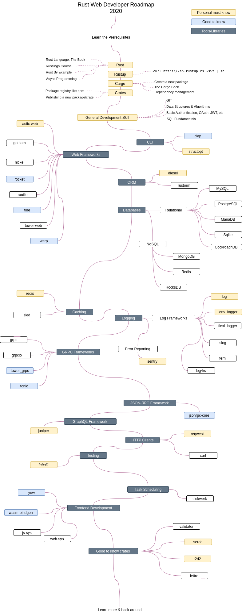

# Rust Web Developer Roadmap 2019

Below you can find a chart demonstrating the path you may take and the libraries you may require to become a Rust Web Developer. This chart is made with inspiration from [Golang Developer Roadmap](https://github.com/Alikhll/golang-developer-roadmap/).

## Disclaimer

> The purpose of this roadmap is to help beginner Rust web developers to navigate through frameworks and libraries in Rust ecosystem while staying as productive as possible. The libraries and (my personal) recommendations listed under each stage of the following roadmap has been researched to the best of my capacity. You should always do research on your end and build up a solution that best works for you.

## Roadmap

## Resources

1. Prerequisites
   - [Rust](https://www.rust-lang.org/)
   - [The Book](https://doc.rust-lang.org/book/)
   - [Rustlings Course](https://github.com/rust-lang/rustlings/)
   - [Rust by Example](https://doc.rust-lang.org/stable/rust-by-example/)
   - [Rustup](https://www.rust-lang.org/tools/install)
   - [Cargo Book](https://doc.rust-lang.org/cargo/index.html)
   - [Crates.io](https://crates.io/)

2. CLI
   - [clap](https://crates.io/crates/clap)
   - [structopt](https://crates.io/crates/structopt)

3. Web Frameworks
   - [actix-web](https://crates.io/crates/actix-web)
   - [gotham](https://crates.io/crates/gotham)
   - [nickel](https://crates.io/crates/nickel)
   - [rocket](https://crates.io/crates/rocket)
   - [rouille](https://crates.io/crates/rouille)
   - [tide](https://crates.io/crates/tide)
   - [tower-web](https://crates.io/crates/tower-web)
   - [warp](https://crates.io/crates/warp)

4. ORM
   - [diesel](https://crates.io/crates/diesel)
   - [rustorm](https://crates.io/crates/rustorm)

5. Caching
   - [redis](https://crates.io/crates/redis)
   - [sled](https://crates.io/crates/sled)

6. Logging
   - [log](https://crates.io/crates/log)
   - [env_logger](https://crates.io/crates/env_logger)
   - [flexi_logger](https://crates.io/crates/flexi_logger)
   - [slog](https://crates.io/crates/slog)
   - [fern](https://crates.io/crates/fern)
   - [log4rs](https://crates.io/crates/log4rs)
   - [sentry](https://crates.io/crates/sentry)

7. GRPC Frameworks
   - [grpc](https://crates.io/crates/grpc)
   - [grpcio](https://crates.io/crates/grpcio)
   - [tower_grpc](https://github.com/tower-rs/tower-grpc)

8. JSON-RPC Framework
   - [jsonrpc-core](https://crates.io/crates/jsonrpc-core)

9. GraphQL Framework
   - [juniper](https://crates.io/crates/juniper)

10. HTTP Clients
   - [reqwest](https://crates.io/crates/reqwest)
   - [curl](https://crates.io/crates/curl)

11. Testing
   - *[Inbuilt](https://doc.rust-lang.org/book/ch11-00-testing.html)*

12. Task Scheduling
   - [clokwerk](https://crates.io/crates/clokwerk)

13. Frontend Development
   - [yew](https://crates.io/crates/yew)
   - [wasm-bindgen](https://crates.io/crates/wasm-bindgen)
   - [js-sys](https://crates.io/crates/js-sys)
   - [web-sys](https://crates.io/crates/web-sys)

14. Good to know crates
   - [validator](https://crates.io/crates/validator)
   - [serde](https://crates.io/crates/serde)
   - [r2d2](https://crates.io/crates/r2d2)
   - [lettre](https://crates.io/crates/lettre)