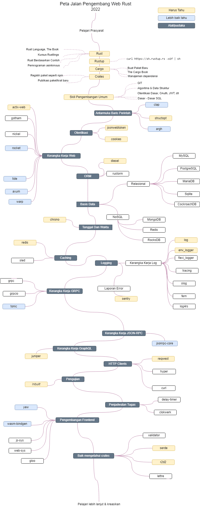

# Peta Jalan Pengembang Web Rust

> Peta jalan untuk menjadi pengembang web [Rust](https://www.rust-lang.org/) pada tahun 2022:

Di bawah ini Anda dapat menemukan bagan yang menunjukkan jalur yang dapat Anda ambil dan perpustakaan yang mungkin Anda perlukan untuk menjadi Pengembang Web Rust. Bagan ini dibuat dengan inspirasi dari [Golang Developer Roadmap] (https://github.com/Alikhll/golang-developer-roadmap/).

[English](../../README.md)
[简体中文版](../zh-CN/README-zh-CN.md)

## Pemberitahuan

> Tujuan dari roadmap ini adalah untuk membantu para pengembang web Rust pemula untuk menavigasi framework dan library di dalam ekosistem Rust dengan tetap seproduktif mungkin. Pustaka dan rekomendasi (pribadi saya) yang tercantum di bawah setiap tahap peta jalan berikut ini telah diteliti sebaik mungkin. Anda harus selalu melakukan penelitian sendiri dan membangun solusi yang paling sesuai untuk Anda.

## Peta Jalan

## Sumber Daya

1. Prasyarat

   - [Rust](https://www.rust-lang.org/)
   - [The Book](https://doc.rust-lang.org/book/)
   - [Kursus Rust](https://github.com/rust-lang/rustlings/)
   - [Rust berdasarkan contoh](https://doc.rust-lang.org/stable/rust-by-example/)
   - [Pemrograman asinkronus](https://rust-lang.github.io/async-book/)
   - [Rustup](https://www.rust-lang.org/tools/install)
   - [Buku Kargo](https://doc.rust-lang.org/cargo/index.html)
   - [Crates.io](https://crates.io/)

2. CLI

   - [clap](https://crates.io/crates/clap)
   - [structopt](https://crates.io/crates/structopt)
   - [argh](https://crates.io/crates/argh)

3. Kerangka Kerja Web

   - [actix-web](https://crates.io/crates/actix-web)
   - [gotham](https://crates.io/crates/gotham)
   - [nickel](https://crates.io/crates/nickel)
   - [rocket](https://crates.io/crates/rocket)
   - [tide](https://crates.io/crates/tide)
   - [axum](https://crates.io/crates/axum)
   - [warp](https://crates.io/crates/warp)

4. ORM

   - [diesel](https://crates.io/crates/diesel)
   - [rustorm](https://crates.io/crates/rustorm)

5. Caching

   - [redis](https://crates.io/crates/redis)
   - [sled](https://crates.io/crates/sled)

6. Logging

   - [log](https://crates.io/crates/log)
   - [env_logger](https://crates.io/crates/env_logger)
   - [flexi_logger](https://crates.io/crates/flexi_logger)
   - [slog](https://crates.io/crates/slog)
   - [fern](https://crates.io/crates/fern)
   - [log4rs](https://crates.io/crates/log4rs)
   - [sentry](https://crates.io/crates/sentry)

7. Kerangka Kerja GRPC

   - [grpc](https://crates.io/crates/grpc)
   - [grpcio](https://crates.io/crates/grpcio)
   - [tonic](https://crates.io/crates/tonic)

8. Kerangka Kerja JSON-RPC

   - [jsonrpc-core](https://crates.io/crates/jsonrpc-core)

9. Kerangka Kerja GraphQL

   - [juniper](https://crates.io/crates/juniper)

10. Klien HTTP

    - [reqwest](https://crates.io/crates/reqwest)
    - [curl](https://crates.io/crates/curl)

11. Pengujian

    - _[Inbuilt](https://doc.rust-lang.org/book/ch11-00-testing.html)_

12. Penjadwalan Tugas

    - [clokwerk](https://crates.io/crates/clokwerk)
    - [delay-timer](https://crates.io/crates/delay_timer)

13. Pengembangan Frontend

    - [yew](https://crates.io/crates/yew)
    - [wasm-bindgen](https://crates.io/crates/wasm-bindgen)
    - [js-sys](https://crates.io/crates/js-sys)
    - [web-sys](https://crates.io/crates/web-sys)
    - [gloo](https://crates.io/crates/gloo)

14. Lebih baik mengetahui crates
    - [validator](https://crates.io/crates/validator)
    - [serde](https://crates.io/crates/serde)
    - [r2d2](https://crates.io/crates/r2d2)
    - [lettre](https://crates.io/crates/lettre)

15. Kandungan Karat Tambahan
    - [Rust dalam 30 menit](https://fasterthanli.me/articles/a-half-hour-to-learn-rust)

## Rangkuman

Jika Anda merasa peta jalan ini dapat ditingkatkan, silakan buka PR dengan pembaruan apa pun dan kirimkan masalah apa pun.

## Kontribusi

Peta jalan ini dibangun menggunakan [Draw.io] (https://www.draw.io/). File proyek dapat ditemukan di file `rust-web-developer-roadmap.xml`. Untuk memodifikasinya, buka draw.io, klik **Buka Diagram yang Ada** dan pilih file `xml` dengan proyek. Ini akan membuka peta jalan untuk Anda. Perbarui, unggah dan perbarui gambar-gambar di readme dan buat PR (ekspor sebagai png dengan lebar batas 50px dan perkecil dengan [Compressor.io](https://compressor.io/compress)).

- Buka pull request dengan perbaikan
- Diskusikan ide-ide dalam isu-isu
- Menyebarkan berita

## Lisensi

